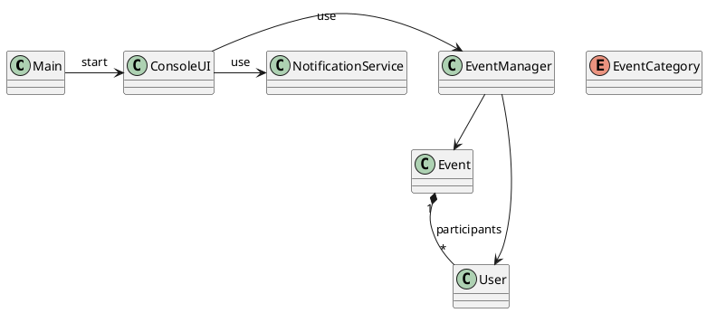

# Event Management System

This system is developed in **Java** using **Eclipse IDE** for event registration and management – a project for the course *Programming Computational Solutions* at **UniRitter University**. The project includes a **UML class diagram** for visualizing the system structure.

---

## Features

- User registration  
- Event registration with predefined categories  
- Confirm and cancel participation in events  
- List events (Ongoing, Past, and Upcoming)  
- Data saved in the file `events.data`  
- Console-based interface  

---

## Step-by-Step to Run

### Requirements

- Java JDK 21 or higher  
- Eclipse IDE (recommended) or any Java IDE  

### Using Eclipse

1. **File → Import → General → Existing Projects into Workspace**  
2. Select the project folder  
3. Right-click on `Main.java`  
4. **Run As → Java Application**  

### Using Terminal

1. Navigate to the project folder  
2. Compile the source files:  

```bash
javac src/*.java
```  

3. Run the application:  

```bash
java -cp src Main
```

---

## UML Class Diagram

The project includes a UML class diagram in PlantUML format to visualize the relationships between classes:



---

## Author

- **Name:** Alysson Tavares  
- **Course:** Programming Computational Solutions – UniRitter University
