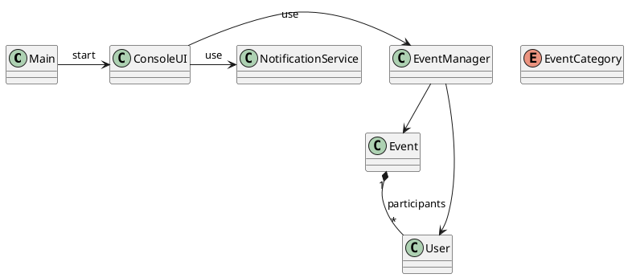

# 📌 Event Registration and Notification System (Java Console)

Project developed in **Java (console)** following the **Object-Oriented paradigm**.

## 🚀 Features
- User registration (name, email, phone)
- Event registration (name, address, category, date/time, description)
- List and sort events
- Join and cancel participation in events
- Simple console notifications
- Data persistence in `events.data`

## 🖥️ How to run
```bash
javac src/*.java
java -cp src Main
```

## 📊 Class Diagram (PlantUML)

---
👨‍💻 Author: Alysson da Silva Tavares
